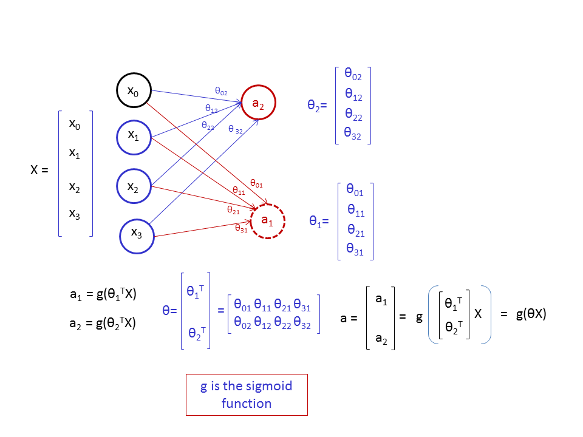

### Introduction

This project implemented the one-vs-all logistic regression and the feedforward propagation of neutral networks using R. This markdown file read the data files and organized functions defined in the function list. The corresponding notebook and the markdown files also explained the derivation of the basic equations used for the implementation of the algorithms. The data used in this project are ex3data1X.txt, ex3dataY.txt, ex3dataTheta1.txt and ex3dataTheta2.txt. These txt files are included in the folder.  

#### Function list: Functions implemented in this markdown notebook
* sigmoid - Sigmoid Function 
* predictOneVsAll - One-vs-all Logistic Regression Prediction Function
* fR - Regularized Logistic Regression cost function
* gR - Regularized Logistic Regression gradient function
* predict - Neural network prediction function

Before we implement the functions, we first load the R libraries for this project.
```{r}
#load the library
library(ggplot2)
library(Rcgmin)
```

**1. Multi-class Classification **          
In this section, we will use logistic regression and neural networks to recognize handwritten digits (from 0 to 9). Example images of these digits are shown below:     


**1.1 Dataset **          
The data set in ex3data1X.txt and ex3dataY.txt contain 5000 training examples of handwritten digits. Now let's first read the data. 
```{r}
image_X<-read.csv('ex3data1X.txt',header=FALSE)
targety<-read.csv('ex3dataY.txt',header=FALSE)

cat("The dimension of image_X is ",dim(image_X),"\n")
cat("The dimension of targety is ",dim(targety),"\n")
```
In the dataset, each training exmple is a 20 pixel by 20 pixel grayscale image of the digit. Each pixel is represented by a floating point number indicating the grayscale intensity at that location. The 20 by 20 grid of pixels have been converted to a 400-dimensional vector in the input file of ex3data1X.txt. 

Here we see that the image_X dataframe has 5000 rows, corresponding to the 5000 observations in the training examples. In addition, each row of image_X contains 400 columns, corresponding to the 400-dimension pixel vector for each observation. The ith row in image_X dataframe corresponds to the pixel vector of the ith observation. Finally, targety is a vector consisting of 5000 elements. The ith element defines what number the image of the ith observation contains. Notice that in this vector, digit 0s in training examples were mapped to the value of 10 for the convenience of programming, meaning that if the image of an observation corresponds to 0, its value in the targety vector was set as 10. For all the other digits from 1 to 9, the digit images and the corresponding values in targety vector were consistent.

The task of this project is to correctly predict the number given the image vector of that number in the training set. We will first try the one-vs-all logistic regression model. To build the logistic regression model, we first build the design matrix by adding the intercept column to the image_X dataframe.

```{r}
number_labels<-10
feature_number<-dim(image_X)[2]+1
design_matrix<-as.matrix(cbind(v0=rep(1,times=dim(image_X)[1]),image_X))
```
**1.2 Vectorizing Logistic Regression **          
In the one-vs-all logistic regression model, we will need to tain multiple logistic regression classifiers. Vectorizing the code is important to make sure the training is effiecient.

Vectorized logistic regression algorithm and the equations for computing cost and gradient for regularized logistic regression have been dervied in the logistic regression project. Please refer to LogisticRegression.nb.html markdown notebook for the details of the derivation. In this project, I just listed the equations for regularized logistic regression as follows:

$$ J \left( \theta \right) = -\frac{1}{m} \left[ Y^Tlog\left(sigmoid \left(X \theta \right)\right) +(1-Y)^Tlog(1-sigmoid(X\theta))  \right]+ \frac{\lambda}{2m}\theta_{\left[1:n\right]}^T\theta_{\left[1:n\right]}  ~~~~~~~~~~~Eq(1)$$ 

$$\frac{\partial J\left(\theta\right)}{\partial\theta} = \frac{1}{m} (X\theta-Y)^TX + \frac{\lambda}{m}\theta_{\left[1:n\right]}  ~~~~~~~~~~~Eq(2)$$
The following R code implemented the regularized cost and gradient function based on Eqs(1) and (2). These functions are actually the same as those implemented in the Logistic Regression project.
```{r}
sigmoid<-function(x) 1/(exp(-x)+1)

fR<-function(theta,X,y,lambda){
  m<-length(y)
  cost<- -1*(1/m)*(t(y)%*%log(sigmoid(X%*%theta))+t(1-y)%*%log(1-sigmoid(X%*%theta)))+
    lambda/(2*m)*t(theta[-1])%*%theta[-1]
  return(cost[1,1])
}

gR<-function(theta,X,y,lambda){
  m<-length(y)
  grad<--(1/m)*(t(y-sigmoid(X%*%theta))%*%X)
  grad[-1]<- grad[-1]+lambda/m*theta[-1]
  return(t(grad))
}
```

**1.3. One-vs-all Classification **             
In this part of the project, we implemented one-vs-all classfication algorithm by tarining multiple regularized losgistic regression classifiers, one for each class. Each classifier predicted the probability of an observation belonging to a particular class. We then assigned the observation to the class having the highest probability.

In the following implementation, a matrix called thetas were created. This matrix contains 10 rows and 401 columns. Each row of the thetas contains the learned logistic regression parameters for one class. 
```{r}
thetas<-matrix(rep(0,times=number_labels*feature_number),nrow=number_labels)

```

Next, we will train the multi-class model by training multiple classifiers. This was done by a for loop. When index i changed from 1 to 10, the 10 classifiers were trained sequentially, and the learned theta values for each classifier were stored in the corresponding row of thetas matrix.

Furthermore, Rcgmin function in Rcgmin package was used to find the optimum theta. This function uses the conjugated gradient minimization algorithm for the efficient search of the optimum values. In the following R code, we use an intial theta vector with all its elements set as 0 for all the classifiers.

Finally, it is important to note that each classifier acts as a "binary" classifer. For example, classifier i only cares if an observation belongs to class i or not. Therefore, when training classifier i, we only need to tell the classifier whether an observation belongs to class i, as shown in the following code. 

```{r}
initial_theta<-rep(0,times=feature_number)
for (i in seq(number_labels)){
  thetas[i,]<-Rcgmin(par=initial_theta,fR,gR,X=design_matrix,y=as.integer(targety==i),lambda=0.1)$par
  }
```
**1.3.1. One-vs-all Prediction **           
After building the one-vs-all classifier on training dataset, we can use it to predict the digit contained in a given image. The prediction is accomplished by the predictOnevsAll() function. This function calcualted the probability of an observation belonging to each class using the established multi-class logistic regression model, and then assigned the observation to the class having the highest probability value.

```{r}
predictAllVsOne<-function(model_X,thetas){
  predict<-sigmoid(model_X%*%t(thetas))
  results<-apply(predict,1,function(x) which(x==max(x),arr.ind=TRUE))
}

pred_results<-predictAllVsOne(design_matrix,thetas)
mean(pred_results==targety)*100
```
The accuracy of the multi-class logistic regression model is ~ 96% for the digit number recognition. 

**2. Neural Networks **          
 This part of the project implemented a neural network to recognize handwritten digits using the same training dataset as before. For this project, parameters from a neural network that had been trained were used to predict which numbers the images contained for training examples. The goal is to implement the feedforward propagation algorithm to use the weights obtained from a trained neural network model for prediction. In the next project, the backpropagation algorithm for learning the neural network parameters will be implemented.

If you understand the logistic regression, then the feedforwad propagation is just a combination of multiple logistic regression models. Let's start from a simple case where there are four input nodes and one output node, as shown in the following figure:

In this figure, the output node, $a_1=g(\theta_1^TX)$ where g is the sigmoid function. Now if we add another output node, $a_2$, then $a_2=g(\theta_2^TX)$. Finally, if we combine all the output nodes into a vector, a, then the vector can be computed as $a=g(\Theta X)$, where each row of the $\Theta$ matrix contains the theta vector for the corresponding output node (remember that Sigmoid function can be directly applied to vectors and matrices). The two output node case is shown in the following figure:  
 
The neural network used in this project is a 3 layer network, including an input layer, a hidden layer and an output layer. The same input data used in the previous multi-class logistic regression model was used in this section. The input layer of the neural network has 401 nodes, corresponding to the 401 features in the design matrix of image_X. The middle layer was designed to have 25 nodes, and the output layer has 10 nodes, corresponding to the 10 different output classes. 

Now, let's read the theta1 and theta2 data, which were obtained by training the neural network.
```{r}
theta1<-as.matrix(read.csv("ex3dataTheta1.txt",header=FALSE))
theta2<-as.matrix(read.csv("ex3dataTheta2.txt",header=FALSE))

cat("The dimension of theta1 is: ",dim(theta1),"\n")
cat("The dimension of theta2 is: ",dim(theta2),"\n")
```
We can see that the dimension of theta1 is 25 by 401. As mentioned previously, the number of rows of the $\Theta$ matrix should be the number of output nodes in the transformation. Since Theta1 is the $\Theta$ matrix for the transformation from the input layer to middle layer, the number of rows of theta1 should be the number of the nodes in middle layer, which is 25. In addition, since Theta2 is the $\Theta$ matrix from the trasformation from middle layer to the output layer, the dimension of theta2 is 10 by 26, corresponding to the number of middle layer nodes (25 plus the biased node) and the 10 output layer nodes, respectively.

For multiple layer neural networks, every node except those in the input layer can be computed using logistic regression. We can compute the third layer (output layer) nodes using logistic regression based on middle layer nodes, which, agian, are computed using logistic regression based on the input layer nodes. The computed values of the 10 nodes in the output layer for a training example are the probabilities of that example belonging to the corresponding classes. Class with the highest probability were then assigned to that example. The R code for the prediction is shown in the following section:

```{r}
predict<-function(t1,t2,X){
  results<-sigmoid(cbind(rep(1,dim(X)[1]),sigmoid(X%*%t(t1)))%*%t(t2))
  return(apply(results,1,function(x) which.max(x)))
}

pred<-predict(theta1,theta2,design_matrix)

accuracy<- mean(pred==targety)*100

cat("the accuracy by neron net work is ",accuracy,'\n')
```

 
