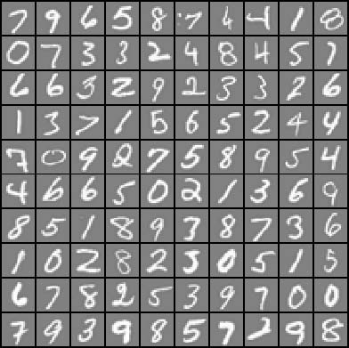

### Introduction

This project implemented the backpropagation algorithm for neutral networks using R. This markdown file read the data files and organized functions defined in the function list. The corresponding notebook and the markdown files also explained the derivation of the basic equations used for the implementation of the algorithms. The data used in this project are ex4data1X.txt, ex4dataY.txt, ex4dataTheta1.txt and ex4dataTheta2.txt. These txt files are included in the folder.  

#### Function list: Functions implemented in this markdown notebook
* sigmoid - Sigmoid Function 
* randInitializeWeights - Function to randanmly initialize neural network weight parameters
* debugInitializeWeights - Function for initializing weights
* nnCostFunction - Neural network cost function
* nnGradient - Neural network gradient function
* checkNNGradients - Function to help check your gradients
* computeNumericalGradient - Numerically compute gradients
* predict - Neural network prediction function

Before we implement the functions, we first load the R libraries for this project.
```{r}
#load the library
library(ggplot2)
library(Rcgmin)
```

**1. Neural Networks **                  
In the Multi-class classification project, we implemented feedforward propagation algorithm for neural networks and used it to predict handwritten digits. However, the network weight parameters used for the prediction were provided by a trained neural network. In this section, we will implement the backpropagation algorithm to learn these weight parameters for the neural network and use the established neural network model to recognize handwritten digits (0-9) based on their digit images. 

**1.1 Visualizing the data **                                 
The data used in this project contains 5000 training examples of hand-written digits. Example images of these digits are shown below:     



Now let's read the data:
```{r}
# read the trained weights for the middle and the outer layers
theta1<-as.matrix(read.csv("ex4dataTheta1.txt",header=FALSE))
theta2<-as.matrix(read.csv("ex4dataTheta2.txt",header=FALSE))
nnparameter<-c(as.vector(theta1),as.vector(theta2))

image_X<-as.matrix(read.csv('ex4data1X.txt',header=FALSE))
targety<-read.csv('ex4dataY.txt',header=FALSE)

cat("the dimension of image_X is: ",dim(image_X),"\n")
cat("the dimension of targey is: ",dim(targety),"\n")
```
In the dataset, each training example is a 20 pixel by 20 pixel grayscale image of the digit. Each pixel is represented by a floating point number indicating the grayscale intensity at that location. The 20 by 20 grid of pixels have been converted to a 400-dimentional vector in the input file of ex4data1X.txt. 

The dimension of image_X is 5000 by 400. Each row corresponds to one observation in the training dataset. The 400 columns of each row correspond to the 20 pixel by 20 pixel grayscale intensity of the digit image for each observation. These 20 by 20 grid of pixels is "unrolled" into the 400-dimensional vector in each row. The targety is a 5000-dimensional vector that contains labels for the training set. In this vector, digit zero has been mapped to the value 10. Therefore, if a training example image contains the digit 0, then the corresponding label in targety vector is 10. For all the other digits from 1-9, the digit images and the corresponding values in the targety vector are consistent. This mapping is for the convenience of the programming.

**1.2. Model representation **          
The neural network used in this project has 3 layers: an input layer, a hidden layer and an output layer. Each input layer node corresponds to a feature in image_X input dataframe, considering the extra bias node, the input layer contains 401 nodes. The hidden layer is the second layer, which contains 25 nodes (not including the biase node), and the third layer is the output layer, which contains 10 nodes, corresponding to the 10 classes of the images (digit number 0-9).

A set of network weight parameters, $\theta^{(1)}$ and $\theta^{(2)}$ are provided. These parameters were obtained from a trained neural network model. Based on the previous discussion in the mult-class classification project, since $\theta^{(1)}$ is the parameter matrix for the transformation from input to hidden layers, the number of rows in $\theta^{(1)}$ should equal to the number of nodes in the hidden layer, exclusive of the bias node (25 nodes). In addition, the number of the columns of $\theta^{(1)}$ should equal to the number of nodes in the input layer, including the bias node (401 nodes). Similarly, the dimension of $\theta^{(2)}$ should be 10 by 26, since $\theta^{(2)}$ is the parameter matrix for the transformation from hidden layer (25 nodes exclusive of the biase node), to the output layer (10 nodes).

**1.3. Feedforward and cost function **             
As mentioned in the Multi-class classification project, given a training example $x^{(i)}$, we can compute the output nodes in the output layer by freedforward algorithm. For the training example $x^{(i)}$, the computed value for node k in the output layer is expressed as $h_\theta(x^{(i)})_k$. The value of $h_\theta(x^{(i)})_k$ is the probability that example i belongs to class k. Value of $y_k^{(i)}$ is 1 if the digit label of example i equals to k, or 0 otherwise. The probability of observing example $x^{(i)}$ with its corresponding label $y_k^{(i)}$ is then $h_\theta(x^{(i)})_{k}~ ^{y^{(i)}}(1-h_\theta(x^{(i)})_{k})^{(1-y^{(i))}})$. Considering there are K output layer nodes and m training examples, the cost function can be obtained from the negative likelihood of observing all training examples with their corresponding labels as:
$$J(\theta) = -\frac{1}{m}\sum_{i=1}^m\sum_{k=1}^k\left[y_k^{(i)}log((h_\theta(x^{(i)}))_k)+(1-y_k^{(i)})log(1-(h_\theta(x^{(i)}))_k)\right] ~~~~Eq(1)$$
Here we define the label $y^{(i)}$ as a vector containing 10 elements. All the elements of $y^{(i)}$ are set as either 0 or 1. Let's say the 10 elements of $y^{(i)}$ are defined as $y_1^{(i)}$,$y_2^{(i)}$,$y_3^{(i)}$,....$y_{10}^{(i)}$, and $x^{(i)}$ is an image of digit 5, then $y_5^{(i)} = 1$, and all the other elements from $y_1^{(i)}$ to $y_{10}^{(i)}$ are set as 0.

To vectorize Eq(1) in matrix format, let's just look at the first item in Eq(1):
$$\sum_{i=1}^m\sum_{k=1}^k\left[y_k^{(i)}log((h_\theta(x^{(i)}))_k)\right] ~~~~~~~~~~~~~~~~Expression~(1) $$
In the following R code, the value of this summation item is computed as the following: first created a label matrix whose ith row is $y^{(i)}$. As mentioned previously, vector $y^{(i)}$ is a 10 element vector. Therefore, the label matrix is a 5000 by 10 matrix. Second, created the $log(h_\theta)$ matrix, whose ith row contains the log of the 10 output layer node values for input $x^{(i)}$. Therefore, the $log(h_\theta)$ matrix is another 5000 by 10 matrix. By multiplying the label matrix and $log(h_\theta)$ matrix element-wise, we will get a 5000 by 10 matrix, and elements of this matrix will correspond to $y_k^{(i)}log((h_\theta(x^{(i)}))_k)$ items in Expression (1). The value of Expression (1) can be calculated by computing the sum of all the element in this matrix. The second summation item $\sum_{i=1}^m\sum_{k=1}^k\left[(1-y_k^{(i)})log(1-(h_\theta(x^{(i)}))_k)\right]$ can be computed similarly. The R code for computing the regularized cost function is shown below:
```{r}
#The cost function is defined as adding all the errors and theta square together

sigmoid<-function(x){
  1/(exp(-x)+1)
}

nnCostFunction<-function(nnparameter,input_layer_size,hidden_layer_size,number_labels,X,y,lambda){
  t1_elements<-(input_layer_size+1)*hidden_layer_size
  total_size<-length(nnparameter)
  t2_start<-t1_elements+1
  
  t1<-matrix(nnparameter[1:t1_elements],nrow=hidden_layer_size)
  t2<-matrix(nnparameter[t2_start:total_size],nrow=number_labels)
  X<-cbind(v0=rep(1,dim(X)[1]),X)
  
  observation_numbers<-dim(X)[1]
  h<- sigmoid(cbind(rep(1,observation_numbers),sigmoid(X%*%t(t1)))%*%t(t2))
  t<-matrix(0L,nrow=observation_numbers,ncol=number_labels)
  for(i in seq(observation_numbers)){
    t[i,y[i,1]]=1
  }
  m<-observation_numbers
  -1/m*sum(t*log(h)+(1-t)*log(1-h))+lambda/(2*m)*(sum((t1[,-1])*t1[,-1])+sum(t2[,-1]*t2[,-1]))
 
}
```
In the nnCostFunction, we first computed the values of the output layer nodes for each training example, store the resulting $log(h_\theta)$ values in matrix h, then established the label matrix t. Finally, the summation items were computed by mulitply matrix t and log(h), and (1-t) and log(1-h) element-wise. The regulation item was easily obtained by adding the squares of the norms of $\theta^{(1)}$ and $\theta^{(2)}$ excluding the bias nodes, excluding the bias nodes. 

Now we can test the nnCostFunction using the training dataset (image_X, and targety) with lambda = 1. The function also requires the weight parameters $\theta^{(1)}$ and $\theta^{(2)}$, and the structure of the neural network including the numbers of nodes in each layer.
```{r}

nnparameter<-c(as.vector(theta1),as.vector(theta2))
nn_input_layer_size=400
nn_hidden_layer_size=25
nn_number_labels=10
nn_observation_number=dim(image_X)[1]

nnCostFunction(nnparameter,nn_input_layer_size,nn_hidden_layer_size,nn_number_labels,image_X,targety,1)
```
The cost was calculated to be around 0.38. 

**2. Backpropagation **                  
This part of the project implemented the backpropagation algorithm.                     

**2.1. Sigmod gradient **              
One important property of the sigmoid function is that the gradient for sigmoid function $\frac{d}{dz}g(z) = g(z)(1-g(z))$

**2.2. Random initialization **                  
Randomly initializing the parameters when training neural netwoks is very important for symmetry breaking. The strategy used for this implementation is to randomly select values for parameter matrice $\theta^{(l)}$ from a uniform distribution in the range of $[-\epsilon_{init},\epsilon_{init} ]$. In this project, $\epsilon = 0.12$, which is determined by the numbers of nodes in layers adjacent to $\theta^{(l)}$. The R code for function to generate random values to initialize $\theta^{(l)}$ is shown below:
```{r}
randInitializeWeights<-function(L_in, L_out){
  epsilon_init=0.12
  w<-matrix(runif((L_in+1)*L_out)*epsilon_init*2-epsilon_init,nrow=L_out,ncol=L_in+1)
  return(w)
}
```
This function first generates numbers from a uniform distrubtion in [0,1], multiplying the generated numbers by $2\epsilon_{init}$, and then subtracting the mutiplied numbers by $\epsilon_{init}$. The generated numbers are then fomatted to the matrix format according to the number of nodes adjacent to $\theta^{(l)}$.

**2.3 Backprogpation **             
This part implements the backpropagation algorithm. I will first derive the equations for the implementation. It would be useful to review the feedforward algorithm and define the symbols that will be used in the derivation. The figure below describes the feedforward algorithm for a 3 layer neural network:


**2.3.1. Definition of terminology and symbols **               
**a. layer index, l **          
Each layer in the neural network has an index. In the network shown in the above figure, the indices for the input, hidden and output layers are 1, 2 and 3, respectively. The layer indices are shown as superscripts in symbols. For example, $\theta^{(1)}$ means the  weight parameter matrix from layer 1 (input layer) to layer 2 (hidden layer).          

**b.theta vectors, $\theta^{(l)}$ and $\theta_{ij}^{(l)}$ **                                    
The network weight parameters connecting nodes in adjacent layers of the network are defined as $\theta_{ij}^{(l)}$, where $\theta_{ij}^{(l)}$ connects the node i in layer l to node j in layer (l+1). In addition, $\theta^{(l)}$ represents the matrix consisting of all the weight parameters $\theta_{ij}^{(l)}$ connecting nodes in layer l to nodes in layer (l+1). Furthermore, as shown in the figure, $\theta^{(l)}[k,]$ represents the kth row of $\theta^{(l)}$ matrix, which is a vetor that includes the weight parameters connecting all the nodes in layer l to node k in layer (l+1). Finally, $\theta^{(l)}[,j]$ represents the jth column of $\theta^{(l)}$ matrix, which is a vetor that includes the weight parameters connecting nodes j in layer l to all the nodes in layer (l+1).  

**c. nodes, $Z_{j}^{(l)}$ **
The symbol $Z_{j}^{(l)}$ refers to node j in layer l, and $Z_0^{(l)}$ refers to the bias node in layer l. In addition, $Z^{(l)}$ refers to all the nodes in layer l. In addition, nodes in input layer are expressed as $x_j$, where j is the index of the node, and $x_j=Z_j^{(1)}$. Similarly, X refers to the vector including all the elements in the input layer.

**d. activation, $a_{j}^{(l)}$ **               
Feedforward algorithm is based on logistic regression using the nodes in layer l and $\theta^{(l)}$ to compute the nodes in layer l+1. The first step is to obtain the activation values for nodes in layer (l+1), and then transform the activation values using sigmoid function. The transformed values are then assigned as the node values. For node j in layer (l+1), its activation value $a_j^{(l+1)}$is obtained by $\left(\theta^{(l)}[j,]\right)^TZ^{(l)}$, and its node value is computed as $g\left(a_j^{(l+1)}\right)$, where g is the sigmoid function.

**e. target variable vector, y **                       
y is a k-dimensional vector, where k equals to the number of nodes in output layer. In this project, since there are 10 nodes in the output layer, k=10. In addition, if the digit label of a training example is i, then the ith element of the corresponding y vector will be 1 and all its other elements will be 0. For example, if the label for a training example is 5, then the 5th element of its y vector will be 1 and all the other elments in y will be 0.

To make the derivation simple, the equations are derived based on one single training example, which converts Eq(1) to:
$$J(\theta) = \sum_{k=1}^{l_3}\left[-y_klog(Z_k^{(3)})-(1-y_k)log(1-Z_k^{(3)})\right] ~~~~Eq(2)$$
Where $Z_k^{(3)}$ is the kth node in the output layer (l=3), and $l_3$ is the number of nodes in the output layer. The gradient can be obtained by the chain rule:

$$\frac{\partial J(\theta)}{\partial a_k^{(3)}}=\frac{\partial J(\theta)}{\partial Z_k^{(3)}}\frac{\partial Z_k^{(3)}}{\partial a_k^{(3)}} = \left(y_k\frac{1}{Z_k^{(3)}}Z_k^{(3)}(1-Z_k^{(3)})-(1-y_k)\frac{1}{1-Z_k^{(3)}}(1-Z_k^{(3)})Z_k^{(3)}\right)=\left(Z_k^{(3)}-y_k\right) ~~~~~~~~~~Eq(3)$$
Further extending Eq(3), we can obtain the gradient for any of the network parameters in $\theta^{(2)}$ by the chain rule:
$$\frac{\partial J(\theta)}{\partial \theta_{jk}^{(2)}} = \frac{\partial J(\theta)}{\partial a_k^{(3)}}\frac{\partial a_k^{(3)}}{\partial \theta_{jk}^{(2)}} = \left(Z_k^{(3)}-y_k\right)z_j^{(2)} ~~~~~~~~~~~~~Eq(4)$$
The gradient for parameters in $\theta^{(1)}$ is more complicated. To find $\frac{\partial J(\theta)}{\partial \theta_{ij}^{(1)}}$, we need to first find $\frac{\partial J(\theta)}{\partial z_j^{(2)}}$:
$$\frac{\partial J(\theta)}{\partial z_j^{(2)}} = \sum_{k=1}^{l_3}\frac{\partial J(\theta)}{\partial a_k^{(3)}} \frac{\partial a_k^{(3)}}{z_j^{(2)}} =\sum_{k=1}^{l_3}\left(Z_k^{(3)}-y_k\right)\theta_{jk}^{(2)} ~~~~~~~~~~~~~Eq(5) $$
The gradient for any weight parameter in $\theta^{(1)}$ can be obtained from Eq(5) and chain rule as:
$$\frac{\partial J(\theta)}{\partial \theta_{ij}^{(1)}} = \frac{\partial J(\theta)}{\partial z_j^{(2)}}\frac {\partial z_j^{(2)}}{\partial a_i^{(2)}} \frac {\partial a_i^{(2)}}{\partial \theta_{ij}^{(1)} } = \sum_{k=1}^{L_3}\left((Z_k^{(3)}-y_k)\theta_{jk}^{(2)}\right)z_j^{(2)}(1-z_j^{(2)})x_i  ~~~~~~~~~~~~~Eq(6)$$
If we defien $\delta_k^{(l)}$ as the error for node k in layer l, then for the output layer nodes, which is the third layer, 
$$\delta^{(3)}_k = \left(Z_k^{(3)}-y_k\right)$$ . 
According to Eq(4), $$\frac{\partial J(\theta)}{\partial \theta_{jk}^{(2)}} =\delta^{(3)}_kz_j^{(2)} ~~~~~~~~~~~ Eq(7)$$

For the hidden layer, 
$$\delta^{(2)}_j =  \sum_{k=1}^{L_3}\left((a_k^{(3)}-y_k^{(3)})\theta_{jk}^{(2)}\right)z_j(1-z_j) = \sum_{k=1}^{L_3}\left((Z_k^{(3)}-y_k)\theta_{jk}^{(2)}\right)z_j^{(2)}(1-z_j^{(2)}) = \left(\theta^{(2)} \left[,j \right]\right)^T\delta^{(3)}z_j^{(2)}(1-z_j^{(2)})  ~~~~~~~~~~~~~Eq(8)$$

According to eqs(6) and (8), we get: $$\frac{\partial J(\theta)}{\partial \theta_{ij}^{(1)}} = \delta^{(2)}_jx_i ~~~~~~~~~~~~~Eq(9)$$

Comparing Eqs(7) and (9), we find the genera equation for weight parameter gradient as  
$$\frac{\partial J(\theta)}{\partial \theta_{ij}^{(l)}}=\delta_j^{(l+1)}Z_i^{(l)} ~~~~~~~~~~~~~Eq(10)$$
In addition, for output layer, 
$$\delta^{(l)}_j =  Z_j^{(l)} -y_j ~~~~~~~~~~~~ Eq(11)$$
and for intermediate layers, 

$$\delta^{(l)}_j  = \left(\theta^{(l)} \left[,j \right]\right)^T\delta^{(l+1)}z_j^{(l)}(1-z_j^{(l)})  ~~~~~~~~~~~~~Eq(12)$$ 


Eqs(10-12) are derived based on one single tarining example. In the following R code, function nnGradient() calculated the gradient of the parameter matrice $\theta^1$ and $\theta^2$ for the entire training dataset exmples using vectorized calcuations based on matrix multiplication. The basic logic for the calculation was exactly based on eqs(10-12). In addition, $\frac{\lambda}{m}\theta[,-1]$ was added for calculation of regularized gradient. Here $\theta[,-1]$ referes to the parameter matrices excluding the bias columns. Finally, to make it easy to optimize the network parameters in the next step, nnGradient() function formated and returned the calculated gradient as a vetor.

```{r}
nnGradient<-function(nnparameter,input_layer_size,hidden_layer_size,number_labels,X,y,lambda){
  Theta1_elements<-(input_layer_size+1)*hidden_layer_size
  total_size<-length(nnparameter)
  Theta2_start<-Theta1_elements+1
  
  Theta1<-matrix(nnparameter[1:Theta1_elements],nrow=hidden_layer_size)
  Theta2<-matrix(nnparameter[Theta2_start:total_size],nrow=number_labels)
  X<-cbind(v0=rep(1,dim(X)[1]),X)
  
  #calculate the predited result matrix using forward feeding (b values for output layer in eq(10))
  m<-dim(X)[1]
  h<- sigmoid(cbind(rep(1,m),sigmoid(X%*%t(Theta1)))%*%t(Theta2))
  
  #establish the output matrix for observed results (y vectors in eq(10))
  t<-matrix(rep(0L,m*number_labels),nrow=m)
  for(i in seq(m)){
    t[i,y[i,1]]=1
  }
  
  # the outer layer error is the difference between observed and predicted matrices. This is delta values in Eq(10)
  delta_outlayer<-h-t
  
  #calculate error transferred from outer to middle layer
  transferred_error_middle<-delta_outlayer%*%Theta2[,-1]
  #calculate the predicted values for the middle layer (all b values in hidden layer in Eq(11))
  pred_middle<-sigmoid(X%*%t(Theta1))
  #combine the transferred and the derivative of sigma function of the middle layer to get delta error. This implements Eq(11)
  delta_middle<-transferred_error_middle*pred_middle*(1-pred_middle)  #5000*25 each line corresponding to one obs
  
  #calculate the devrivative for each first layer weights using eq(9)
  theta1_gradient<- 1/m*t(delta_middle)%*%X  #X is the first layer b values
  #the derivative for the weights between middle and outerlayer can be easier to calculate
  theta2_gradient<- 1/m*t(delta_outlayer)%*%cbind(rep(1,m),pred_middle)
  
  #consider the regularization
  theta1_gradient[,-1]<-theta1_gradient[,-1]+lambda/m*Theta1[,-1]
  theta2_gradient[,-1]<-theta2_gradient[,-1]+lambda/m*Theta2[,-1]
  c(as.vector(theta1_gradient),as.vector(theta2_gradient))
  
}

```

**2.4. Gradient checking **          
Gradient checking is uesed to test if the gradient function can retrun the correct gredient values for netwrok parameters. As shown in the previous section, nnGradient function was implemented based on the derivatives of the cost function versus each network weight parameter, $\frac{\partial J(\theta)}{\partial \theta_ij^{(l)}}$. More specifically, each element returned by the gradient function vector corresponds to the change in cost function caused by the small disturbance in each network parameter while holding the other parameters constant, divided by the value of the disturbance of that parameter. 

A simple method to check if the values returned by the gradient function are correct is to directly introduce a small disturbance to the network weight parameter vector. Each time, only one weight parameter is changed while others are held constant, and then evaluate the ratio of the corresponding cost function change to the value change of that parameter. Repeat this procedure for all the network parameters, and store the results in a vector. We can then compare this vector to the vector returened by the gradient function element-wise to see if they are consistent.

In the follwoing R code, function computeNumericalGradient was used to calculate the gradient of a parameter vector using the cost function. For each element $\theta_i$ in the input vector, a small change of 2e-4 was introduced to that element while holding the other elements constant, and computed the corresponding $\frac{dJ(\theta)}{d \theta_i}$. These $\frac{dJ(\theta)}{d \theta_i}$ values were stored in a vetor and returned.  

```{r}
computeNumericalGradient<-function(theta,FUN = nnCostFunction,...){
  numgrad = rep(0,length(theta))
  perturb = rep(0,length(theta))
  e = 1e-4
  for (p in seq_along(theta)){
 # Set perturbation vector
  perturb[p] = e
  loss1 = FUN(theta - perturb,...)
  loss2 = FUN(theta + perturb,...)
  # Compute Numerical Gradient
  numgrad[p] = (loss2 - loss1) / (2*e);
  perturb[p] = 0;
  }
  
  return(numgrad)

}

```

Another function used for this test is the function called debugInitializeWeights(). This function can generate reproducible network weight parameters connecting nodes in adjacent layers given the numbers of nodes in each layer. Using this function, each network parameter in the network is assgined a value between 0 and 0.1. The R code for this function is below: 

```{r}
debugInitializeWeights<-function(fout,fin){
  total_element<-fout*(fin+1)
  w<-matrix(sin(1:total_element),nrow=fout,ncol=fin+1)/10
  return(w)
  
}
```
In the R code of the next chunk, function checkNNGradients() was implemented to check if nnGradient() function can return the correct gradient values. The fucntion first established a small 3 layer nerual network with 3, 5 and 3 nodes in the input, hidden and output layers, respectively. Then the network weight parameters were initialized by degugInitializeWeights function. 5 training examples, each having 4 features and the corresponding label were generated for the test. Gradients of the network parametes were calculated using both functions implemented based on numeric and derivative methods. 

```{r}
checkNNGradients<-function(lambda=0){
  
  input_layer_size = 3
  hidden_layer_size = 5
  num_labels = 3
  m = 5 #number of observations
  
  # We generate some 'random' test data
  Theta1 = debugInitializeWeights(hidden_layer_size, input_layer_size)
  Theta2 = debugInitializeWeights(num_labels, hidden_layer_size)
  # Reusing debugInitializeWeights to generate X
  feature_X  = debugInitializeWeights(m, input_layer_size-1 )
  target_y  = t(1 + t(1:m %% num_labels))
  
  nnpara<-c(as.vector(Theta1),as.vector(Theta2))
  numgrad<-computeNumericalGradient(nnpara,nnCostFunction,input_layer_size,hidden_layer_size,num_labels,feature_X,target_y,lambda)
  grad<-nnGradient(nnpara,input_layer_size,hidden_layer_size,num_labels,feature_X,target_y,lambda)
  
  diff<-numgrad-grad
  total<-numgrad+grad
  
  norm_diff<- sqrt((t(diff)%*%diff)/(t(total)%*%total))
  cat("the norm of the difference is ",norm_diff,'\n')
  result<-as.data.frame(cbind(numgrad,grad))
  names(result)<-c("numgrad","grad")
  return(result)
}
```

Now we check the difference of the gradient values computed by the two method without regularization.
```{r}
check_results<-checkNNGradients()
```
Then set $\lambda$ = 3
```{r}
lambda<-3
check_results<-checkNNGradients(lambda)
```
We can see the difference is very small, which confirms that nnGradient function was correctly implemented.

**2.6. Learning parameters using Rcgmin **

After implementing the neural network cost and gradient functions, the next step is to train the network weight parameters using backpropagation algorithm. Here I used Rcgmin function of the Rcgmin package to learn the network parameters. In the following R code, we first defined the network structure including the numbers of nodes in each layers. Then intialized the network parameters using randInitializeWeights function. These initialized parameters were put together and formatted as a vector. Next, the optimum network parameters were learned by the Rcgmin function. Rcgmin function accepts the initialized network parameters as a vector, names of the cost and gradient functions, which are nnCostFunction and nnGradient, respectively, and other arguments required by the cost and gradient functions. It optimizes network parameters by mininizing the cost. The optimized network parameters were returned as a vector. This vector was reformatted to the matrix format for $\theta^{(1)}$ and $\theta^{(2)}$.    

```{r}
nn_input_layer_size=400
nn_hidden_layer_size=25
nn_number_labels=10
nn_observation_number=dim(image_X)[1]

initial_theta1<-randInitializeWeights(nn_input_layer_size,nn_hidden_layer_size)
initial_theta2<-randInitializeWeights(nn_hidden_layer_size,nn_number_labels)
initial_thetas<-c(as.vector(initial_theta1),as.vector(initial_theta2))

result_thetas<-Rcgmin(par=initial_thetas,nnCostFunction,nnGradient,input_layer_size=400,hidden_layer_size=25,number_labels=10,X=image_X,y=targety,lambda=1)$par

theta1_length<-(nn_input_layer_size+1)*nn_hidden_layer_size
theta2_start<-theta1_length+1
total_length<-length(result_thetas)
result_theta1<-matrix(result_thetas[1:theta1_length],nrow=nn_hidden_layer_size)
result_theta2<-matrix(result_thetas[theta2_start:total_length],nrow=nn_number_labels)
```
Finally, $\theta^{(1)}$ and $\theta^{(2)}$ obtained from Rcgmin were used to predict the labels of the training examples. This task was accomplished by the predict() function. For each training example, the predict function assigns the index of the output nodes having the highest value as the label of that example.

```{r}
predict<-function(t1,t2,X){
  X<-cbind(rep(1,dim(X)[1]),X)
  results<-sigmoid(cbind(rep(1,dim(X)[1]),sigmoid(X%*%t(t1)))%*%t(t2))
  return(apply(results,1,function(x) which.max(x)))
}
```
In the following R code, the labels of the training dataset was predicted by the predict function, and compared to the corresponding labels in the training dataset. The accuracy was calculated. 
```{r}
pred<-predict(result_theta1,result_theta2,image_X)
accuracy<- mean(pred==targety)*100
cat("the accuracy by neron net work is ",accuracy,'\n')
```
Results showed that the nueral network can predict 99.5% of the training example correctly.


